# BaryoDev Project Template

A universal project template that works with the [BaryoDev Skills Library](https://github.com/BaryoDev/skills) to provide AI-assisted development for any project type.

## 🚀 Quick Start

### 1. Create a New Project

```bash
gh repo create YourOrg/YourProject --template BaryoDev/template-project --public
cd YourProject
```

### 2. Customize for Your Project Type

Open your project in your IDE and prompt the AI:

```
This is a [PROJECT_TYPE] project. Update .cursorrules by fetching skills from https://github.com/BaryoDev/skills:
- [skill-name-1]
- [skill-name-2]

Then add [PROJECT_TYPE]-specific rules:
- [Rule 1]
- [Rule 2]
```

### 3. Start Coding

The AI now knows your project's rules and will assist accordingly!

---

## 📚 Documentation

This template includes a pre-configured **VitePress** documentation site.

### Run Documentation Locally

```bash
npm install
npm run docs:dev
```

Visit `http://localhost:5173` to see your docs.

### Documentation Structure

- **Home** (`docs/index.md`): Landing page with hero and features
- **Guide** (`docs/guide/`): Getting started, installation, quick start, features
- **Reference** (`docs/reference/`): Changelog, FAQ, migration guides

### Build for Production

```bash
npm run docs:build
npm run docs:preview
```

The built site will be in `docs/.vitepress/dist/`.

---

## 📊 Workflow Diagram

```mermaid
flowchart TD
    Start([👤 You: Start New Project]) --> Template[📦 Use BaryoDev/template-project]
    Template --> Clone[🔽 gh repo create MyProject --template]
    Clone --> BaseConfig[📄 Project has minimal .cursorrules<br/>- baryo-coding<br/>- baryo-testing<br/>- baryo-compliance]
    
    BaseConfig --> Decide{What type of<br/>project?}
    
    Decide -->|Android| PromptAndroid[💬 Prompt AI:<br/>'Fetch skills for Android']
    Decide -->|iOS| PromptIOS[💬 Prompt AI:<br/>'Fetch skills for iOS']
    Decide -->|Web App| PromptWeb[💬 Prompt AI:<br/>'Fetch skills for Web']
    Decide -->|Library| PromptLib[💬 Prompt AI:<br/>'Already configured!']
    
    PromptAndroid --> FetchAndroid[🌐 AI fetches from<br/>github.com/BaryoDev/skills:<br/>- webapp-testing<br/>- frontend-design]
    PromptIOS --> FetchIOS[🌐 AI fetches from<br/>github.com/BaryoDev/skills:<br/>- webapp-testing]
    PromptWeb --> FetchWeb[🌐 AI fetches from<br/>github.com/BaryoDev/skills:<br/>- baryo-architecture<br/>- webapp-testing<br/>- frontend-design]
    
    FetchAndroid --> CreateAndroid[✨ AI creates:<br/>baryo-android skill<br/>- Kotlin<br/>- Jetpack Compose<br/>- Hilt DI]
    FetchIOS --> CreateIOS[✨ AI creates:<br/>baryo-ios skill<br/>- Swift<br/>- SwiftUI<br/>- Combine]
    FetchWeb --> CreateWeb[✨ AI creates:<br/>baryo-webapp skill<br/>- React/Vue<br/>- TypeScript<br/>- Vite]
    
    CreateAndroid --> UpdateConfig[📝 AI updates .cursorrules<br/>with all fetched + new skills]
    CreateIOS --> UpdateConfig
    CreateWeb --> UpdateConfig
    PromptLib --> UpdateConfig
    
    UpdateConfig --> Ready[✅ Project Ready!<br/>AI knows all rules]
    
    Ready --> Code[👨‍💻 Start Coding]
    Code --> AIHelp{Need AI help?}
    
    AIHelp -->|Yes| Roles{Which role?}
    AIHelp -->|No| Done([🎉 Ship It!])
    
    Roles -->|Code| DevRole[🔧 Developer Role<br/>Uses: baryo-coding]
    Roles -->|Test| QARole[🧪 QA Role<br/>Uses: baryo-testing]
    Roles -->|Docs| WriterRole[📝 Writer Role<br/>Uses: docx, pdf]
    Roles -->|Deploy| OpsRole[🚀 DevOps Role<br/>Uses: baryo-packaging]
    
    DevRole --> Code
    QARole --> Code
    WriterRole --> Code
    OpsRole --> Code
    
    style Start fill:#e1f5ff
    style Template fill:#fff3cd
    style BaseConfig fill:#d4edda
    style Ready fill:#d1ecf1
    style Done fill:#d4edda
    
    classDef skillRepo fill:#f8d7da,stroke:#721c24
    class FetchAndroid,FetchIOS,FetchWeb skillRepo
```



---

## 📚 Example Prompts

### Android Project
```
This is an Android project. Update .cursorrules by fetching these skills from https://github.com/BaryoDev/skills:
- webapp-testing (for UI automation)
- frontend-design (for Material Design)

Then add Android-specific rules:
- Use Kotlin (not Java)
- Jetpack Compose for UI
- Hilt for dependency injection
- MVVM architecture
- Coroutines for async operations
```

### iOS Project
```
This is an iOS project. Update .cursorrules by fetching these skills from https://github.com/BaryoDev/skills:
- webapp-testing (for UI testing)

Then add iOS-specific rules:
- Use Swift (not Objective-C)
- SwiftUI for UI
- Combine for reactive programming
- MVVM architecture
- Async/await for concurrency
```

### Web Application
```
This is a web application. Update .cursorrules by fetching these skills from https://github.com/BaryoDev/skills:
- baryo-architecture (Vertical Slices)
- webapp-testing (Browser automation)
- frontend-design (UI components)

Then add web-specific rules:
- Use TypeScript
- React with Vite
- TailwindCSS for styling
- React Query for data fetching
```

### .NET Library
```
This is a .NET library. Update .cursorrules by fetching these skills from https://github.com/BaryoDev/skills:
- baryo-packaging (Manual NuGet releases)

Then add library-specific rules:
- Target .NET Standard 2.0
- Zero external dependencies
- Provide both sync and async APIs
- Include XML documentation
```

### Machine Learning Project
```
This is a machine learning project. Update .cursorrules by fetching these skills from https://github.com/BaryoDev/skills:
- baryo-testing (for model validation)

Then add ML-specific rules:
- Use Python 3.11+
- PyTorch framework
- Type hints mandatory
- Reproducible experiments (seed everything)
- Document model architecture
```

---

## 🎭 AI Role Switching

Once configured, the AI can switch between roles based on your requests:

### 👨‍💻 Developer Role
**Trigger:** "Add a new feature", "Refactor this code"  
**Uses:** `baryo-coding`, `baryo-architecture`

### 🧪 QA Engineer Role
**Trigger:** "Test this", "Write tests for..."  
**Uses:** `baryo-testing`, `webapp-testing`

### 📝 Technical Writer Role
**Trigger:** "Document this", "Create a user guide"  
**Uses:** `docx`, `pdf`, `pptx`

### 🚀 DevOps Role
**Trigger:** "Prepare for release", "Set up CI/CD"  
**Uses:** `baryo-packaging`, `baryo-compliance`

---

## 📖 Available Skills

Browse all available skills in the [BaryoDev Skills Library](https://github.com/BaryoDev/skills/tree/main/skills):

### Core BaryoDev Skills
- [baryo-coding](https://github.com/BaryoDev/skills/tree/main/skills/baryo-coding) - Performance-first coding standards
- [baryo-architecture](https://github.com/BaryoDev/skills/tree/main/skills/baryo-architecture) - Vertical Slice Architecture
- [baryo-testing](https://github.com/BaryoDev/skills/tree/main/skills/baryo-testing) - Testing standards
- [baryo-compliance](https://github.com/BaryoDev/skills/tree/main/skills/baryo-compliance) - License & compliance
- [baryo-packaging](https://github.com/BaryoDev/skills/tree/main/skills/baryo-packaging) - Release management

### Document Skills
- [docx](https://github.com/BaryoDev/skills/tree/main/skills/docx) - Word document creation
- [pdf](https://github.com/BaryoDev/skills/tree/main/skills/pdf) - PDF manipulation
- [pptx](https://github.com/BaryoDev/skills/tree/main/skills/pptx) - PowerPoint generation
- [xlsx](https://github.com/BaryoDev/skills/tree/main/skills/xlsx) - Excel spreadsheets

### Development Skills
- [mcp-builder](https://github.com/BaryoDev/skills/tree/main/skills/mcp-builder) - MCP server generation
- [webapp-testing](https://github.com/BaryoDev/skills/tree/main/skills/webapp-testing) - Browser automation
- [frontend-design](https://github.com/BaryoDev/skills/tree/main/skills/frontend-design) - UI/UX design

### Utility Skills
- [skill-creator](https://github.com/BaryoDev/skills/tree/main/skills/skill-creator) - Create new skills
- [theme-factory](https://github.com/BaryoDev/skills/tree/main/skills/theme-factory) - Design systems

---

## 🏗️ Project Structure

```
template-project/
├── .cursorrules          # AI behavior configuration
├── .github/
│   └── workflows/        # CI/CD workflows (add as needed)
├── src/                  # Source code
├── tests/                # Test files
├── docs/                 # Documentation
├── LICENSE               # MPL-2.0 License
└── README.md             # This file
```

---

## 🤝 Contributing

To add a new skill to the library:

1. Create the skill in your project
2. Format it as a `SKILL.md` file
3. Submit a PR to [BaryoDev/skills](https://github.com/BaryoDev/skills)

---

## 📄 License

This template is licensed under the [MPL-2.0 License](LICENSE).

Individual skills in the [BaryoDev Skills Library](https://github.com/BaryoDev/skills) may have different licenses (check each skill's directory).

---

## 🆘 Support

- **Skills Library:** https://github.com/BaryoDev/skills
- **Issues:** https://github.com/BaryoDev/template-project/issues
- **Discussions:** https://github.com/BaryoDev/template-project/discussions
