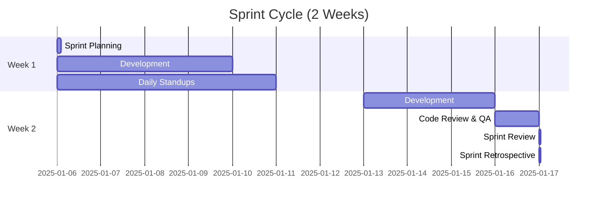

# Sprint Standards

## Sprint Cycle

BaryoDev follows a **2-week sprint cycle** with the following structure:



## Sprint Ceremonies

### 1. Sprint Planning (Monday, Week 1)
**Duration**: 2 hours  
**Participants**: Full team

**Agenda**:
1. Review sprint goal
2. Estimate stories (Planning Poker)
3. Commit to sprint backlog
4. Identify dependencies and risks

**Output**: Sprint backlog with committed items

### 2. Daily Standup (Every Day, 15 min)
**Time**: 9:00 AM  
**Format**: Async (GitHub Discussions) or Sync (Video call)

**Questions**:
- What did I do yesterday?
- What will I do today?
- Any blockers?

### 3. Sprint Review (Friday, Week 2)
**Duration**: 1 hour  
**Participants**: Team + Stakeholders

**Agenda**:
1. Demo completed work
2. Gather feedback
3. Update product backlog

### 4. Sprint Retrospective (Friday, Week 2)
**Duration**: 1 hour  
**Participants**: Team only

**Format**: Start-Stop-Continue
- **Start**: What should we start doing?
- **Stop**: What should we stop doing?
- **Continue**: What should we continue doing?

## Story Point Estimation

| Points | Complexity   | Time Estimate          |
| ------ | ------------ | ---------------------- |
| 1      | Trivial      | < 2 hours              |
| 2      | Simple       | 2-4 hours              |
| 3      | Moderate     | 4-8 hours              |
| 5      | Complex      | 1-2 days               |
| 8      | Very Complex | 2-3 days               |
| 13     | Epic         | 3-5 days (break down!) |

**Rule**: Stories > 8 points must be broken down.

## Definition of Done

A story is "Done" when:
- [ ] Code is written and follows `baryo-coding` standards
- [ ] Unit tests written and passing
- [ ] Integration tests passing (if applicable)
- [ ] Code reviewed and approved
- [ ] Documentation updated (VitePress)
- [ ] Changelog updated
- [ ] Deployed to staging
- [ ] QA verified
- [ ] No known bugs

## Sprint Metrics

Track these metrics for each sprint:

### Velocity
- **Definition**: Total story points completed
- **Goal**: Maintain consistent velocity (±20%)

### Burndown
- **Track**: Daily remaining story points
- **Goal**: Smooth downward trend

### Quality
- **Metrics**:
  - Test coverage (goal: >80%)
  - Bug count (goal: <5 per sprint)
  - Code review turnaround (goal: <24 hours)

## Sprint Board

Use GitHub Projects with these columns:

```
📋 Backlog → 🎯 Sprint Backlog → 🚧 In Progress → 👀 In Review → ✅ Done
```

## Sprint Roles

### Product Owner
- Prioritizes backlog
- Defines acceptance criteria
- Attends sprint review

### Scrum Master (Rotating)
- Facilitates ceremonies
- Removes blockers
- Tracks metrics

### Development Team
- Estimates work
- Delivers features
- Self-organizes

## Best Practices

### DO:
- ✅ Break down large stories
- ✅ Update task status daily
- ✅ Ask for help when blocked
- ✅ Review code within 24 hours
- ✅ Write tests first (TDD)

### DON'T:
- ❌ Add scope mid-sprint
- ❌ Skip retrospectives
- ❌ Ignore technical debt
- ❌ Work in isolation
- ❌ Merge without review

## Emergency Procedures

### Critical Bug in Production
1. Create hotfix branch
2. Fix and test
3. Fast-track review (same day)
4. Deploy immediately
5. Add to sprint backlog retroactively

### Scope Change Mid-Sprint
1. Discuss with Product Owner
2. Swap equal-sized story out
3. Document in sprint notes
4. Update sprint goal if necessary
